# OnlineLibrary

ONLINE LIBRARY

Objective:-

The main objective of Online Library  is to manage where admin can add students and books , can issue and return books and also view the statistics of issued & returned books. The project is totally built at administrative end and thus only admin is guaranteed the access. The purpose of the project is to built an application program to reduce the manual work.

Functional  Requirements:-

Admin:

       o	Can Login

       o	Add Students

       o	Add Books

       o	Issue Books

       o	Return Books

       o	View Statistics

       o	Can Logout

Software Specificatios:-

              Operating System   	 : 	Windows 10/x-64

              Languages  		 : 	java 

              Front End	   	 : 	Swing

              Platform		 : 	NetBeans IDE 8.2

              Backend                             : 	MySQL

Classes of Library:-

               o	Student class-Manages all the information about students.

	                    New Student

               o	Book Class-Manages all the information about books.

	                    New Book

	                    Issue Book

	                    Return Book

Classes and their attributes:-

              o	Student attributes: studentId,name,fatherName,courseName,branchName.

              o	Book attributes: bookIdname,publisher,price,publishYear.

              o	Issue attributes: bookId,studentId,issueDate,dueDate,returnBook.

CLASS DIAGRAM

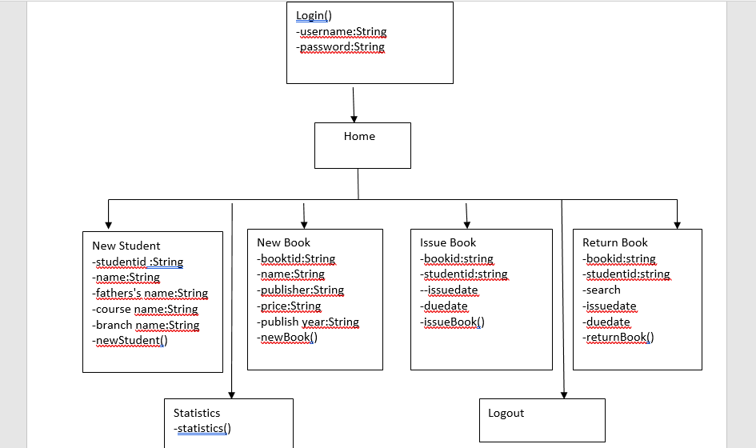

 

ACTIVITY DIAGRAM

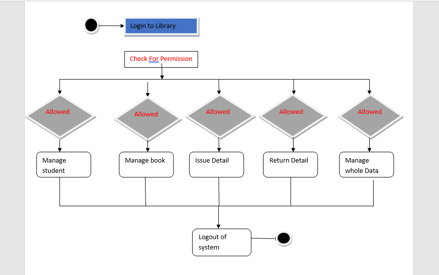

	

DATAFLOW DIAGRAM

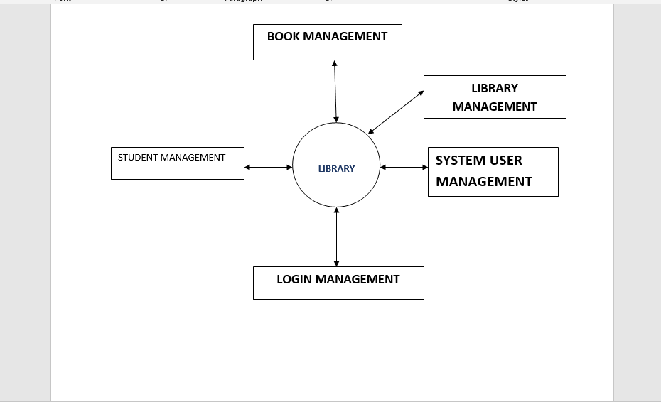

ER DIAGRAM

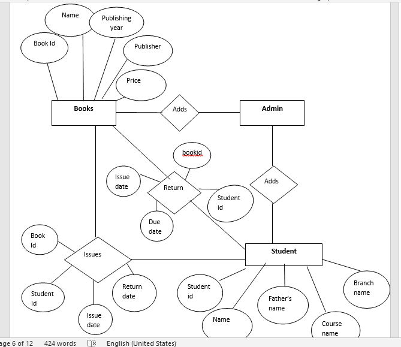

	

SEQUENTIAL DIAGRAM

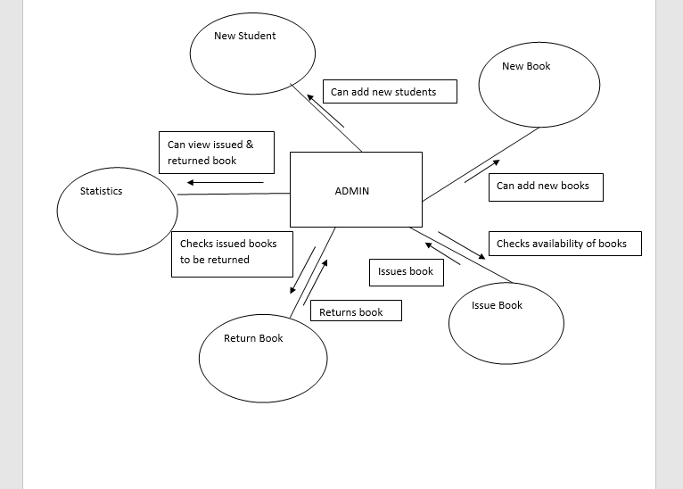

How Project Works  

When we run the login file,a window will get open.

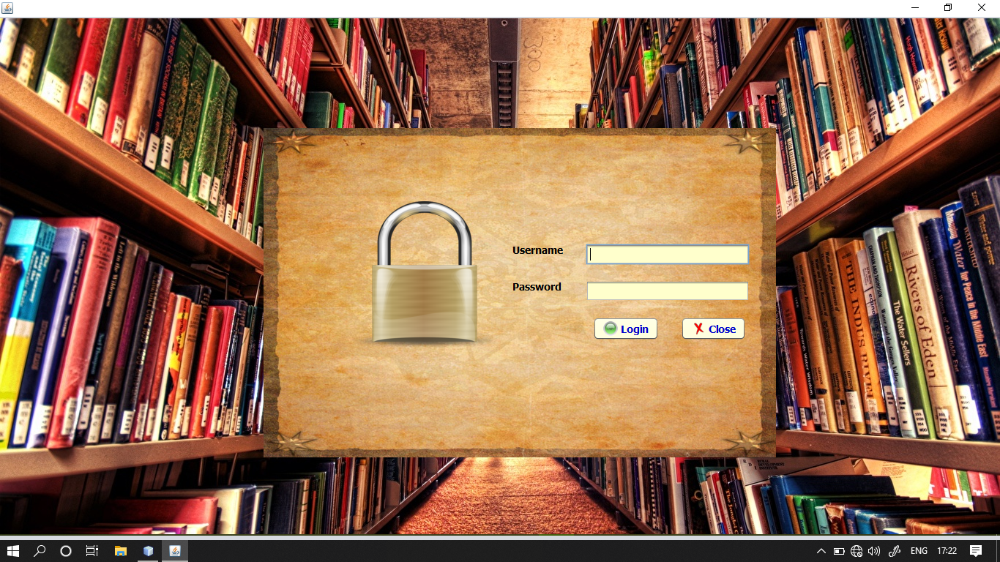

Write name and password: It must be admin for name and admin for password.
 

On logging in ,a home page gets open.

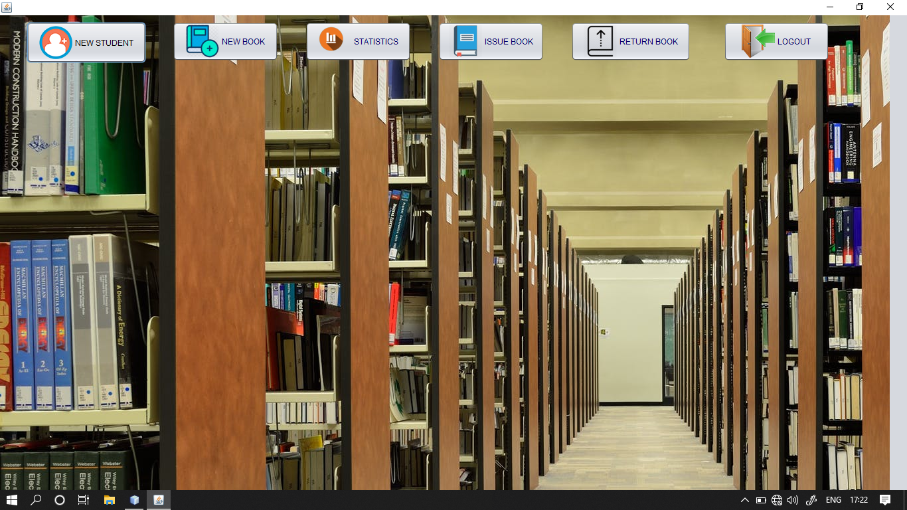

Click on New Student Button.

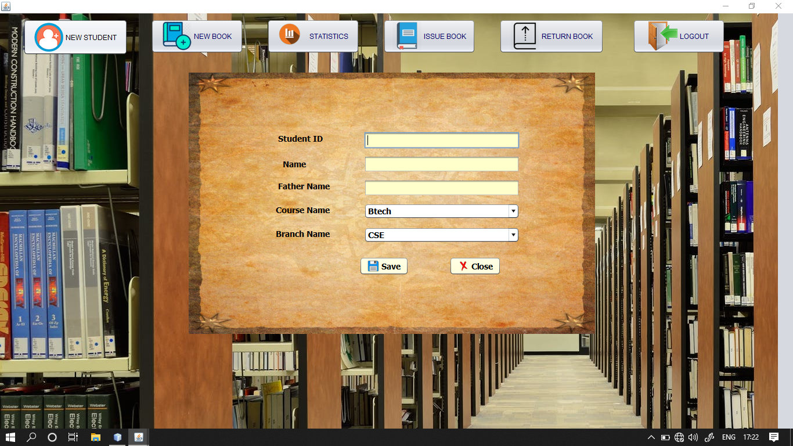 

Fill the required details,

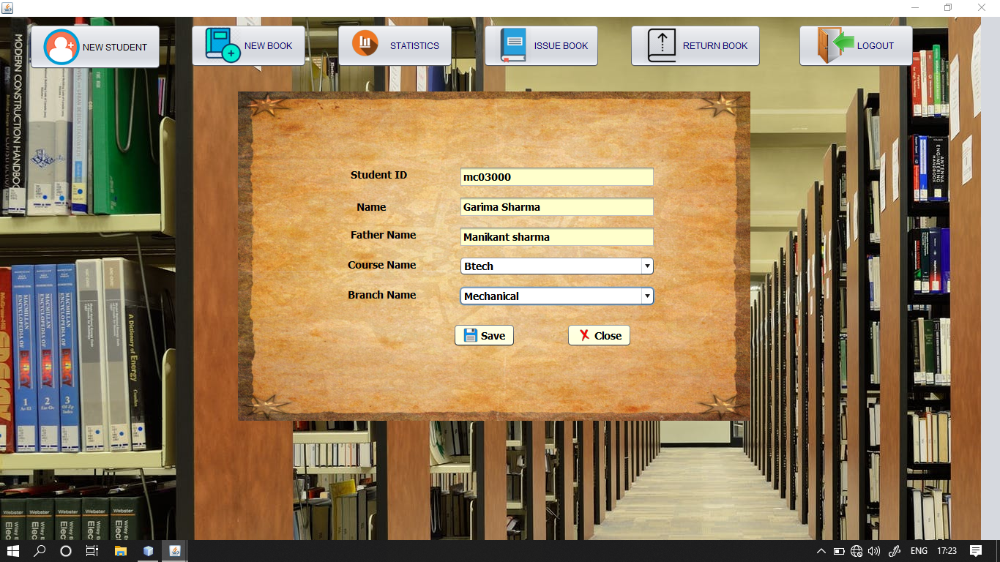
 

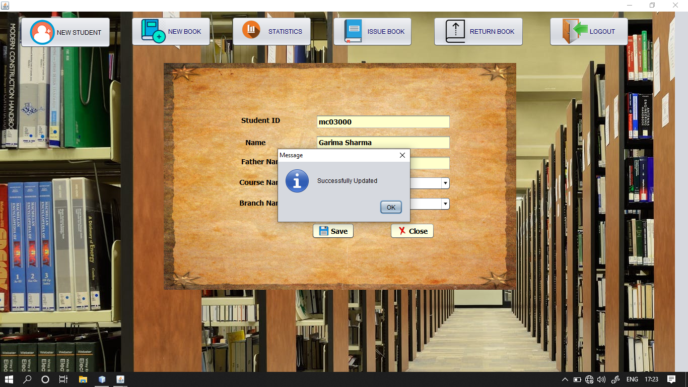

 

Now, click on New Book Button and fill the required details.

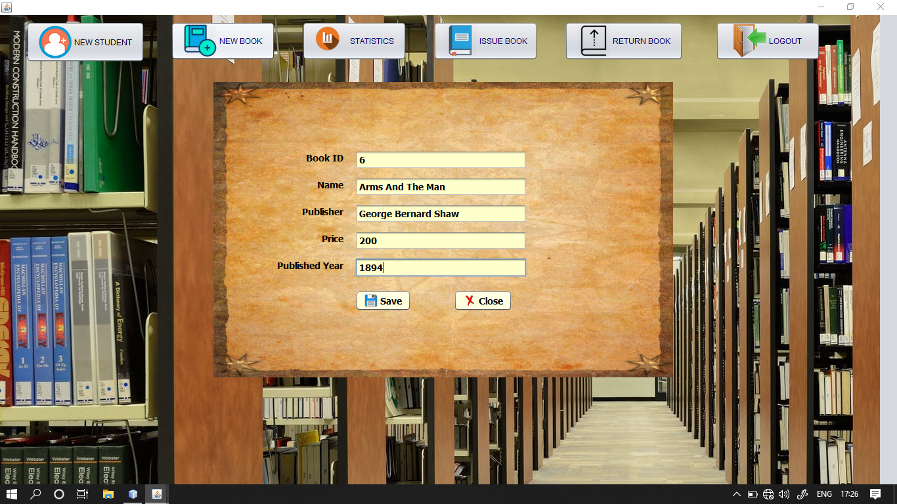 

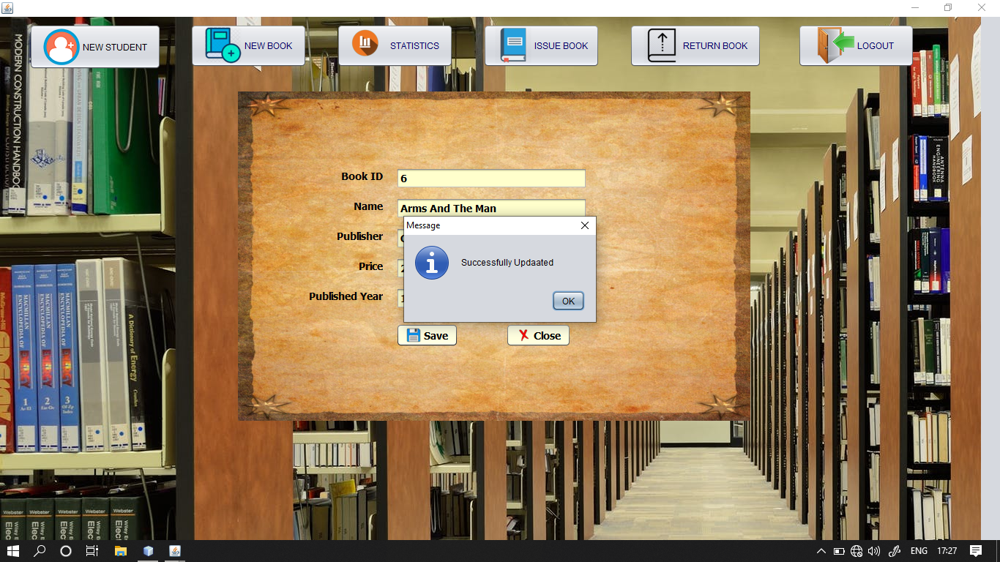 

To issue book, click on Issue Book Button. Also , fill the details.   

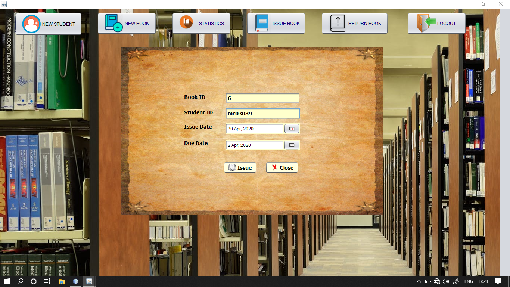
 

To return book,click on Return Book Button.

Click on Statistics Button to view statistics of issued and returned book.

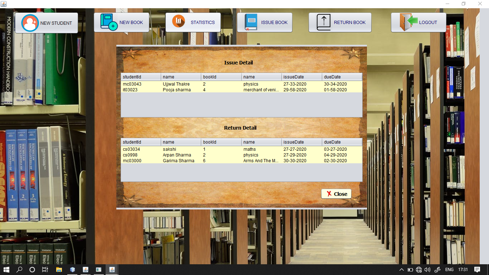

To logout,click on Logout button.

